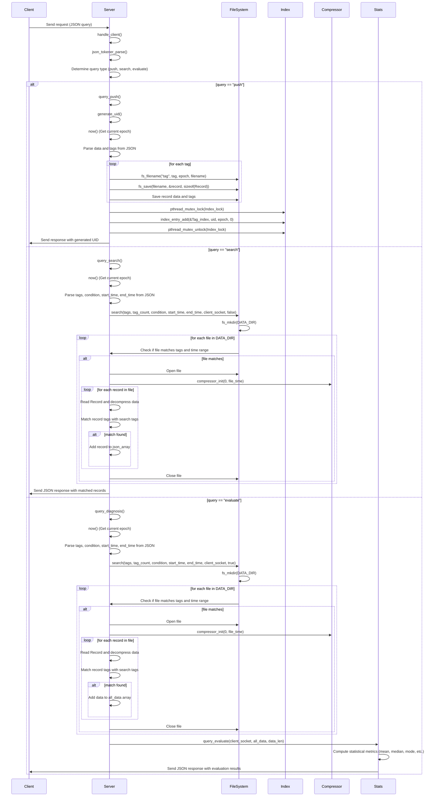
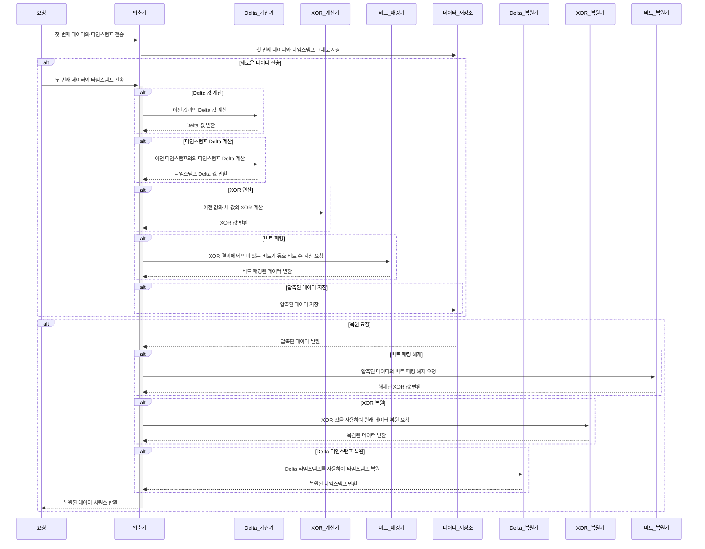

# TicTacDB

똑딱디비! ⏰💾🤹

인플럭스DB에 대해 한 번 파헤쳐보며 시계열 데이터베이스에 대해 공부하면서 

perl CGI 시절의 추억을 살려 심플하게 한 번 만들어보았습니다.

추가로 압축알고리즘(델타인코딩)으로 조금 손보게되었습니다.

이 TicTacDB가 추구하는 DBMS 조건은 ... 

- 시계열 DB
- 저사양 서버(1 CORE, 1 GB RAM)에서도 짱짱하게 돌아갈 것
- 입력, 검색. 통계연산만 올바로 할 것.
- 누구나 쉽게 커스터마이즈 할 수 있는 코드를 제공할 것.
- 컴파일 시 500kb를 넘지 말 것. 

## 데이터 파일관리

```math
{tag name}-YYYYMMDD.db
```
위 형식으로 데이터를 관리합니다.

- 단일 파일로 관리할 경우 속도저하 문제가 생길 수 있을 것 같음
- 샤딩 또는 클러스터링 구현 시 골치아픈 일을 줄이기 위해
- 알 수 없는 파일시스템의 오류로 데이터 유실 시 하나라도 건질 수 있는 기회!

## Todo

- [ ] 리팩토링

- [ ] 인덱싱 최적화

- [ ] 전용 웹페이지 만들어보기

- [ ] 모멘텀 이벤트 기록 기능 추가

- [ ] 스트림 기능 추가

- [ ] 설정파일 읽기 (진행중)

## 기능

* push (데이터 푸시)
* search (데이터검색)
* evaluate (연산하기)

이게 전부입니다 ㅎㅎ

### push

데이터를 푸시합니다. 왜 insert 가 아니라 push냐 물으신다면, 코드를 보기엔 쑤셔넣는 형태라서요.

### search

데이터를 검색합니다.

> `#define LIMIT 100`, `#define CHUNK_SIZE 1000` 두 상수를 주의깊게 봐주세요.

### evaluate

아래 **통계함수선언**의 기능별로 연산하여 값을 반환합니다. 

_나름 통계데이터를 사용하기 쉽게 만들었습니다._

순서는 a-zA-Z0-9 순입니다.

> 주의할 점
> 
> 하모닉평균(c_harmonic_mean)과 지오메트릭평균(c_geometric_mean)값을 연산할때는 0 은 제외하고 연산합니다.
>
> (사실 통계데이터를 구현을 해본적이 없어 공부하다 알게되었습니다.) 0 이 포함되면 무조건 0(infinity) 이니까요.
>
> ```math
> {Harmonic Mean} = \frac{n}{\sum_{i=1}^{n} \frac{1}{x_i}}
> |
> {Geometric Mean} = \left( \prod_{i=1}^{n} x_i \right)^{\frac{1}{n}}
> ```

```c
/**
 * ## 통계함수선언
 *
 */
/*  이진 엔트로피 (Binary Entropy) */
double c_bin_entropy ( const double *data, size_t len );

/*  변동계수 (Coefficient of Variation, CV) */
double c_cv ( double mean, double standard_deviation );

/*  기대값 (Expected Value) */
double c_exp_value ( const double *data, size_t len );

/*  기하평균 (Geometric Mean) */
double c_geo_mean ( const double *data, size_t len );

/*  조화평균 (Harmonic Mean) */
double c_harm_mean ( const double *data, size_t len );

/*  사분위범위 (Interquartile Range, IQR) */
double c_iqr ( double *data, size_t len );

/*  첨도 (Kurtosis)# */
double c_kurtosis ( const double *data, size_t len, double mean, double standard_deviation );

/*  평균 절대 편차 (Mean Absolute Deviation, MAD) */
double c_mad ( double *data, size_t len, double median );

/*  평균 절대 편차 (Mean Absolute Error, MAE) */
double c_mae ( const double *data, size_t len );

/*  최대 차이 (Maximum Deviation) */
double c_max_deviation ( const double *data, size_t len, double mean );

/*  절대 편차 중앙값 (Median Absolute Deviation, MeAD) */
double c_mead ( double *data, size_t len );

/*  평균값 (Mean) */
double c_mean ( const double *data, size_t len );

/*  중위값 (Median) */
double c_median ( double *data, size_t len );

/*  최빈값 (Mode) */
double c_mode ( double *data, size_t len );

/*  평균 제곱 편차 (Mean Squared Error, MSE) */
double c_mse ( const double *data, size_t len, double mean );

/*  왜도(MSkewness) : 중위값 기준 왜도 */
double c_mskewness ( double *data, size_t len, double median );

/*  퍼센트 범위 (PercentRange) */
double c_percent_range ( const double *data, size_t len );

/*  백분위슈 (Percentiles) */
double c_percentile ( double *data, size_t len, double percentile );

/*  범위 (Range) */
double c_range ( const double *data, size_t len );

/*  제곱평균 (Root Mean Square, RMS) */
double c_rms ( const double *data, size_t len );

/*  제곱평균 로그 (RMSLE) */
double c_rmsle ( const double *data, size_t len );

/*  표준편차 (Standard Deviation) */
double c_std_deviation ( const double *data, size_t len, double mean );

/*  절사평균 (Trimmed Mean) */
double c_trim_mean ( double *data, size_t len, double trim_ratio );

/*  분산 (Variance) */
double c_variance ( const double *data, size_t len, double mean );

/*  왜도(ZSkewness) : 0 기준 왜도 */
double c_zskewness ( const double *data, size_t len, double mean );

/*  사분위수 (Quartiles) */
void c_quartiles ( double *data, size_t len, double *q1, double *q2, double *q3 );
```

### 시퀀스

똑딱DB의 시퀀스다이어그램입니다.

**Client** 열아래 세가지 기능만 따라가보면, 시퀀스별로 사용하는 함수들로 연결되어 보기 편하게 작성되었습니다.



## 압축알고리즘

Delte 인코딩으로 TAG 기준 압축 알고리즘을 구현해보았습니다.

비트패킹으로 조금이나마 용량을 줄여보려 했지만 쉽지는 않군요.

아래는 알고리즘 시퀀스입니다.




_아 졸리다.. 낼 첫 출근인데 밤새코딩을 했네.. 삶은 고통이다_
